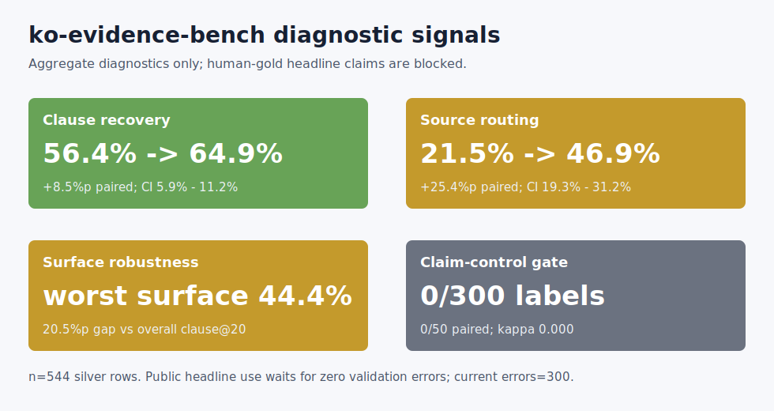

# ko-evidence-bench

Evidence sufficiency and abstention metrics for Korean retrieval. Insurance is
the first testbed.

## Thesis

Real Korean insurance questions are asked in community language. Citable answers
live in clause language. This repo scores whether a retrieval system crossed
that gap, and whether it stopped when it could not.

This is the public shell of a private search lab. It contains metrics, schemas,
fixtures, and reports. It does not contain community crawls, messenger exports,
or copyrighted policy corpora.

The current aggregate-only study draft is
`reports/measurement_study_draft.md`. The current artifact-alignment report is
`reports/flagship_alignment.md`.

## Current Verified Signals

<!-- BEGIN: current-verified-signals -->
These are checked-in aggregate diagnostics, not final benchmark claims:

| Signal | Current Evidence | Status |
|---|---:|---|
| Retrieval eval size | 544 silver rows | scored with bootstrap CIs |
| Best checked-in `clause@20` | 64.9% | retrieval signal only |
| `always_policy` route accuracy | 21.5% | silver proxy |
| query-keyword route accuracy | 31.8% | silver proxy |
| cohort-aware route accuracy | 46.9% | silver proxy |
| Double-label agreement seed | 0 / 50 paired; kappa 0.000 | headline blocked |
| Adjudicated human route labels | 0 / 300 complete | headline blocked |
| Full system comparison matrix | 7 / 15 implemented; 7 not run; 1 blocked | headline blocked |

The generated readiness report is intentionally conservative:
`reports/study_readiness.md` currently says
**NO-GO for public headline claims** until the 50-row
double-label seed, 300-row human route-label workset, and full system
comparison matrix are completed and validated.
<!-- END: current-verified-signals -->

## Diagnostic Figure



The generated hero report is `reports/hero_signal.md`. It compresses the
current aggregate diagnostics into one first-screen signal while keeping the
human-gold claim gate visible.

The public wording guard is `reports/claim_ledger.md`: it says which diagnostic
claims are currently allowed, which claims are blocked, and what evidence is
needed next.

## Public Probe Set

The public synthetic probe package is `probes/ko_evidence_probe_v0/`. It
contains query variants, intent-level qrels, and synthetic evidence snippets.
`reports/probe_privacy_report.md` records the schema and privacy screen for
that package.

The qualitative example gallery is `reports/qualitative_gallery.md`. It shows
synthetic side-by-side source-routing failures over the same public probe set.

The system comparison ledger is `reports/system_matrix.md`. It records which
systems are backed by checked-in evidence and which analyzer, dense, hybrid, or
reranker comparisons are still not run.

## Reviewer Demo

The shortest review path is `reports/reviewer_demo.md`. It walks through the
README figure, hero signal, claim ledger, measurement-study draft, human-gold
rehearsal, and readiness gate in the order a reviewer should inspect them.

Regenerate it with `make build-reviewer-demo`; `make verify` checks that it is
current.

## What This Evaluates

The scorecard treats retrieval as more than "did we find a similar paragraph?"

| Metric | Question Answered |
|---|---|
| `route_accuracy` | Did the system choose the right source tier? |
| `evidence_sufficiency@k` | Did top-k contain enough citable evidence? |
| `wrong_source_rate@k` | Did top-k cite evidence from a disallowed source tier? |
| `abstention_precision/recall` | Did the system correctly stop when evidence was insufficient? |
| `clause_recall@k` | For policy-answerable questions, did top-k include the expected clause? |

The fixture is small on purpose. It exists to make the metrics easy to inspect.
Private aggregate studies can use the same scorecard without exposing raw user
text.

## Data Behind The Work

The private lab currently has:

- 36,983 insurer policy clause passages from 111 products.
- 165,970 derived real-user query candidates from community crawls.
- 7,324 meaningful messenger-conversation messages after obvious system-message filtering.
- 56,293 additional community Q&A archive rows.
- Silver retrieval diagnostics where `structural_cross_rrf` reached
  `clause@10 = 83.4%` on a strict silver core of `n=229`.
- Runtime-honest pack-only diagnostics on a larger silver qrel set of `n=544`,
  where `structural_pack` reached `clause@20 = 56.4%` with a 95% bootstrap CI of
  `52.4% - 60.5%`.
- Runtime-honest full cross-rerank diagnostics on the same `n=544` set, where
  `structural_cross_text` reached `clause@20 = 64.9%` with a 95% bootstrap CI of
  `60.8% - 68.8%`.

These numbers are context, not final benchmark claims. Public headline numbers
need bootstrap confidence intervals first.

## Quickstart

```bash
make test
make reproduce-table-1
make reproduce-route-audit-workflow
make reproduce-human-gold-rehearsal
make reproduce-route-scorecard
make reproduce-route-cohort-scorecard
make reproduce-surface-scorecard
make reproduce-route-surface-scorecard
make reproduce-runtime-surface-scorecard
make reproduce-layer-attribution
make check-audit-surface-coverage
make reproduce-normalization-ablation
make reproduce-intent-inventory
make reproduce-intent-surface-export
make reproduce-substrate-profile
make check-study-readiness
make build-hero-signal
make build-claim-ledger
make build-reviewer-demo
make build-probe-privacy-report
make build-qualitative-gallery
make build-system-matrix-report
make build-measurement-study
make build-alignment-report
make verify
```

Containerized demo:

```bash
make docker-demo
```

This builds the local image and reruns the fixture table, layer attribution,
readiness gate, generated-report checks, probe privacy screen, and
public-safety scan inside the container.

Expected output is a small scorecard over synthetic fixture runs:

```text
system  n  route_acc  suff@3  wrong_src@3  abst_p  abst_r  clause@3
always_policy  5  0.200  1.000  0.400  0.000  0.000  1.000
source_routed_demo  5  1.000  1.000  0.000  1.000  1.000  1.000
```

`make reproduce-route-audit-workflow` runs a fully synthetic route-audit dry-run:
CSV export, reviewer import, agreement, adjudication validation, and qid-only
label promotion. Its report is checked in at
`reports/route_audit_workflow_fixture.md`.

`make reproduce-human-gold-rehearsal` runs a synthetic completed-label rehearsal:
adjudicated labels validate, promote into qid-only route labels, pass
stress-axis coverage, and feed both route and route-surface scorecards. Its
report is checked in at `reports/human_gold_rehearsal_fixture.md`. This checks
the path real labels will use; it is not a human-gold result.

`make reproduce-route-scorecard` runs a qid-only source-route scorecard against
synthetic labels and route predictions. This is the public dry-run for the
private human-label path: once adjudicated route labels are promoted, the same
metrics score route accuracy and abstention behavior without raw text.

`make reproduce-route-cohort-scorecard` runs the same qid-only route scoring
path sliced by synthetic query cohorts. Private cohort reports use a private
source map so aggregate reports can compare query substrates without exposing raw
source names.

`make reproduce-surface-scorecard` runs a synthetic surface-form robustness
scorecard: the same intent appears in formal, abbreviated, colloquial, and
messenger-style conditions, and the report measures whether success varies by
surface form.

`make reproduce-route-surface-scorecard` runs a route-only surface scorecard.
It slices route and abstention behavior by intent family, surface form, and trap
class, separating source-route failures from retrieval-hit failures.

`make reproduce-runtime-surface-scorecard` joins qid-only surface metadata with
runtime retrieval hit booleans. It reports whether `clause@20` and `exact@20`
vary by intent family, surface form, and trap class without publishing raw qids,
evidence ids, or text.

`make reproduce-layer-attribution` attributes failed synthetic retrieval rows to
one primary diagnostic layer: abstention, source routing, register gap, surface
fragmentation, evidence-form mismatch, or residual evidence miss. This is the
Table-2-style decomposition hook for the measurement study; it is not a final
human-gold attribution result.

`make check-audit-surface-coverage` verifies that a human-audit workset covers
the same route, intent-family, surface-form, and trap-class axes used by the
diagnostic reports before reviewers spend time labeling it.

`make reproduce-normalization-ablation` compares a raw-surface baseline run
against a normalized/expanded candidate run and reports aggregate rescue and
regression counts by intent family, surface form, and trap class.

`make reproduce-intent-inventory` summarizes synthetic intent families, source
routes, surface conditions, and trap annotations without exposing qids or raw
query text.

`make reproduce-intent-surface-export` dry-runs the private qrels-to-qid-only
metadata export on synthetic private-like fixtures. The private version joins
private qrels with route labels and emits qid-only intent family, surface form,
trap-class, route, and evidence-id metadata.

`make reproduce-substrate-profile` compares synthetic query substrates using
aggregate text-shape and intent-signal features. The private version profiles
community post contexts, cleaned evaluation queries, and live-style conversation
turns without publishing raw rows or source identifiers.

`make verify` runs tests, reproduction commands, and a public-safety scan
for private-source leakage indicators.

`make docker-demo` builds the local `ko-evidence-bench:local` image and runs a
short containerized reproduction path. It is intended for reviewers who want to
check the fixture table and claim-control reports without setting up a Python
environment first.

`make check-study-readiness` regenerates
`reports/study_readiness.md` from aggregate reports. The command fails only if
the required evidence cannot be parsed; the report itself may correctly say
`NO-GO` while human labels are incomplete.

`make build-hero-signal` regenerates `reports/hero_signal.md` and
`reports/figures/diagnostic_signal_heatmap.svg`, the diagnostic figure used in
the README. `make verify` checks that both artifacts are current.

`make build-claim-ledger` regenerates `reports/claim_ledger.md`, the wording
guard that separates diagnostic claims, blocked human-gold claims, and
out-of-scope claims. `make verify` checks that it is current.

`make build-reviewer-demo` regenerates `reports/reviewer_demo.md`, the
3-minute public walkthrough for reading the repository as a measurement-study
artifact. `make verify` checks that it is current.

`make build-probe-privacy-report` regenerates
`reports/probe_privacy_report.md`, the schema and privacy screen for the public
synthetic probe package. `make verify` checks that it is current.

`make build-qualitative-gallery` regenerates `reports/qualitative_gallery.md`,
the synthetic side-by-side failure examples used to make the route diagnostics
inspectable. `make verify` checks that it is current.

`make build-system-matrix-report` regenerates `reports/system_matrix.md`, the
comparison ledger that separates implemented diagnostic systems from not-run
analyzer, dense, hybrid, and reranker systems. `make verify` checks that it is
current.

`make build-measurement-study` regenerates the aggregate-only study draft from
checked-in reports. `make verify` checks that the committed draft is current.

`make build-alignment-report` regenerates the flagship alignment report, which
shows which portfolio-study gates are implemented and which one still blocks
headline claims.

Private retrieval exports with query-level hit booleans can be summarized without
publishing qids or text:

```bash
python3 scripts/summarize_hit_result.py \
  --result /path/to/private_result.json \
  --baseline structural_pack \
  --run structural_pack \
  --run structural_cross_rrf \
  --out reports/private_aggregate_scorecard.md
```

The current private aggregate report is checked in at
`reports/private_aggregate_scorecard.md`. It is aggregate-only and should be read
as a diagnostic, not a final benchmark.

A larger pack-only diagnostic report is checked in at
`reports/private_544_pack_only_scorecard.md`. It verifies that the 500+ qrel set
can be scored by the existing retrieval stack, but it does not replace the
human-audited route/evidence benchmark.

The full rerank diagnostic report is checked in at
`reports/private_544_full_cross_scorecard.md`. It compares pack-only, cross-text,
and cross-RRF variants on the same 544-row silver set.

Private qrel metadata can also be converted into a qid-only source-route silver
label set while publishing only aggregate counts:

```bash
python3 scripts/export_route_labels.py \
  --qrels /path/to/private_qrels.jsonl \
  --labels-out /path/to/private_route_labels.jsonl \
  --report-out reports/private_route_label_summary.md
```

The current route-label inventory has 544 silver rows. It shows that an
`always_policy` router would reach only 21.5% route accuracy on that private
set, but this is still a silver proxy and requires human audit before headline
claims.

The routing baseline report is checked in at
`reports/private_route_router_baselines.md`. On the same 544-row silver set, a
simple keyword router reaches 31.8% route accuracy, while a cohort-aware router
that uses generic query cohorts reaches 46.9% with a +25.4 percentage-point
paired lift over `always_policy`. These are still silver diagnostics, not final
claims.

The same silver routing comparison is also exported as qid-only route prediction
runs and scored through `scripts/reproduce_route_scorecard.py`; see
`reports/private_route_scorecard_silver.md`. The report includes per-source-tier
route slices and largest gold/predicted route confusions, keeping the evaluation
path the same for silver diagnostics and future human-gold labels.

The private query-cohort scorecard is checked in at
`reports/private_route_cohort_scorecard_silver.md`. It groups private sources
through a generic source map and reports cohort-level route accuracy, abstention
recall, and context-needed policy fallback without raw source names.

The private query-substrate profile is checked in at
`reports/private_query_substrate_profile.md`. It shows that the private lab's
community post contexts, cleaned evaluation queries, and live-style conversation
turns have materially different length and stress-signal distributions. This is
why the repo keeps cohort, surface-form, normalization, and abstention slices
separate instead of treating every text source as one corpus.

The private intent/surface qrel export is summarized at
`reports/private_intent_surface_export_summary.md`, and the aggregate inventory
is checked in at `reports/private_intent_inventory_silver.md`. These reports
show that the 544-row private qrel set can now be sliced by intent family,
surface form, and trap class without exposing raw text. The labels are still
silver metadata and require human audit before public frequency claims.

The private route-surface scorecard is checked in at
`reports/private_route_surface_scorecard_silver.md`. It scores the private
route runs by surface form, intent family, and trap class. It is route-only:
use it with the runtime-surface scorecard to separate routing mistakes from
retrieval-hit misses.

The private runtime-surface scorecard is checked in at
`reports/private_runtime_surface_scorecard_silver.md`. It joins the 544-row
qid-only surface metadata with private runtime hit booleans. On the silver
diagnostic set, `structural_cross_text` reaches `clause@20 = 64.9%`,
`answerable_clause@20 = 71.3%`, and `worst_surface_clause@20 = 44.4%` without
publishing raw ranked evidence ids.

The private audit coverage report is checked in at
`reports/private_audit_surface_coverage_300.md`. It confirms that the 300-row
human-audit workset covers all checked silver axes: 6/6 source routes, 9/9
intent families, 4/4 surface forms, and 10/10 trap classes. This is coverage
only; labels are still incomplete.

To regenerate those private qid-only route runs with a source map:

```bash
python3 scripts/export_route_runs.py \
  --qrels /path/to/private_qrels.jsonl \
  --out-dir /path/to/private_route_runs \
  --source-map /path/to/private_source_cohort_map.json \
  --report-out reports/private_route_run_export_summary.md
```

Private qrels can also be enriched with qid-only intent/surface metadata:

```bash
python3 scripts/export_intent_surface_qrels.py \
  --qrels /path/to/private_qrels.jsonl \
  --route-labels /path/to/private_route_labels.jsonl \
  --qrels-out /path/to/private_surface_qrels.jsonl \
  --report-out reports/private_intent_surface_export_summary.md
```

To start the human audit gate, build a private audit pack and publish only the
sampling summary:

```bash
python3 scripts/build_route_audit_pack.py \
  --qrels /path/to/private_qrels.jsonl \
  --labels /path/to/private_route_labels.jsonl \
  --audit-out /path/to/private_route_audit_pack.jsonl \
  --report-out reports/private_route_audit_pack_summary.md \
  --sample-size 50
```

The current private audit worksets include a 50-row double-label seed and a
300-row adjudication pack, both stratified across source-route classes. They
must be labeled before any human-gold route metric is reported.

After independent labels are filled, `scripts/summarize_route_audit.py` reports
raw agreement and Cohen's kappa without exposing private rows.

After adjudication, `scripts/validate_route_audit.py` checks label completeness
and schema validity, and `scripts/promote_route_audit.py` exports the private
qid-only human route labels consumed by the route scorecard:

```bash
python3 scripts/reproduce_route_scorecard.py \
  --labels /path/to/private_human_route_labels.jsonl \
  --run-dir /path/to/private_route_runs \
  --out reports/private_human_route_scorecard.md
```

The current adjudication workset has been validation-checked and is still
pending: 0 of 300 adjudicated labels are complete. That status is recorded in
`reports/private_route_audit_validation_pending.md`.

Reviewer-editable private CSV templates have also been generated for the
50-row reviewer A/B seed and the 300-row adjudication workset. Their public
summaries are checked in without raw rows.

Reviewers can use `tools/route_review_ui.html` as a local, static CSV editor.
It reads private CSVs in the browser and downloads the reviewed CSV without
uploading data.

## Public/Private Boundary

Public:

- Metric definitions and reference implementation.
- Query/evidence/run schemas.
- Synthetic fixtures.
- Aggregate reports and data cards.
- Reproduction scripts.

Private:

- Raw community crawl text.
- Raw messenger messages.
- Raw community Q&A content.
- Copyrighted policy clauses.
- Any row that can identify a user, product contract, or conversation.

## Repository Layout

```text
ko_evidence_bench/
  ablation.py         # Run-level rescue/regression comparisons.
  intent_inventory.py # Aggregate intent-family inventory metrics.
  intent_surface_export.py # Qid-only intent/surface metadata export.
  layer_attribution.py # Primary failure-layer attribution.
  metrics.py          # Scorecard metrics with bootstrap CIs.
  route_score.py      # Qid-only source-route metrics.
  route_surface.py    # Route/abstention metrics by surface metadata.
  substrate_profile.py # Aggregate query-substrate profiling.
  surface.py          # Surface-form robustness metrics.
  system_matrix.py    # System-comparison matrix coverage checks.
  schemas.py          # Minimal JSONL schema validators.
scripts/
  build_system_matrix_report.py
  build_intent_inventory.py
  build_claim_ledger.py
  build_hero_signal.py
  export_intent_surface_qrels.py
  profile_query_substrates.py
  reproduce_human_gold_rehearsal.py
  reproduce_layer_attribution.py
  reproduce_normalization_ablation.py
  reproduce_table_1.py
  reproduce_route_scorecard.py
  reproduce_route_surface_scorecard.py
  reproduce_surface_scorecard.py
tools/
  route_review_ui.html
fixtures/
  qrels.jsonl
  route_labels.jsonl
  route_runs/
  surface_qrels.jsonl
  surface_runs/
  system_runs/
reports/
  claim_ledger.md
  eval_core_inventory.md
  flagship_alignment.md
  hero_signal.md
  human_gold_rehearsal_fixture.md
  intent_inventory_fixture.md
  layer_attribution_fixture.md
  measurement_study_v0.md
  measurement_study_draft.md
  normalization_ablation_fixture.md
  route_audit_workflow_fixture.md
  route_scorecard_fixture.md
  surface_scorecard_fixture.md
  private_route_scorecard_silver.md
  private_route_run_export_summary.md
  private_route_review_brief_300_adjudicated.md
  private_route_review_batch_priority_50_summary.md
  system_matrix.md
  private_route_review_batch_merge_priority_50_summary.md
  private_route_review_progress_300_adjudicated.md
  study_readiness.md
  private_544_full_cross_scorecard.md
  private_544_pack_only_scorecard.md
  private_aggregate_scorecard.md
  private_route_audit_pack_300_summary.md
  private_route_audit_pack_summary.md
  private_route_audit_validation_pending.md
  private_route_label_summary.md
  private_route_router_baselines.md
  private_route_review_csv_50_reviewer_a_summary.md
  private_route_review_csv_50_reviewer_b_summary.md
  private_route_review_csv_300_adjudicated_summary.md
docs/
  data_statement.md
  route_label_protocol.md
  schemas.md
tests/
```

## Scope Statement

This is not an insurance advice system, a chatbot, or a Korean dictionary. It is
a retrieval evaluation workbench: did the system find enough citable evidence,
and did it abstain when it should?
