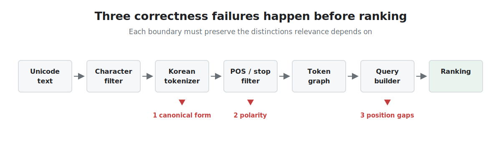
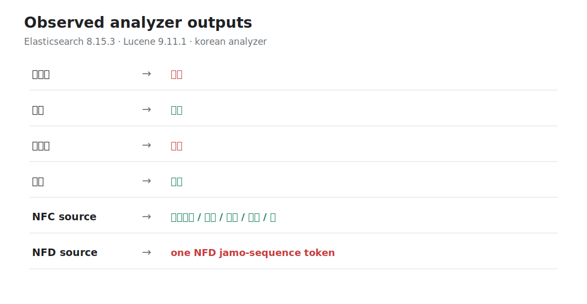
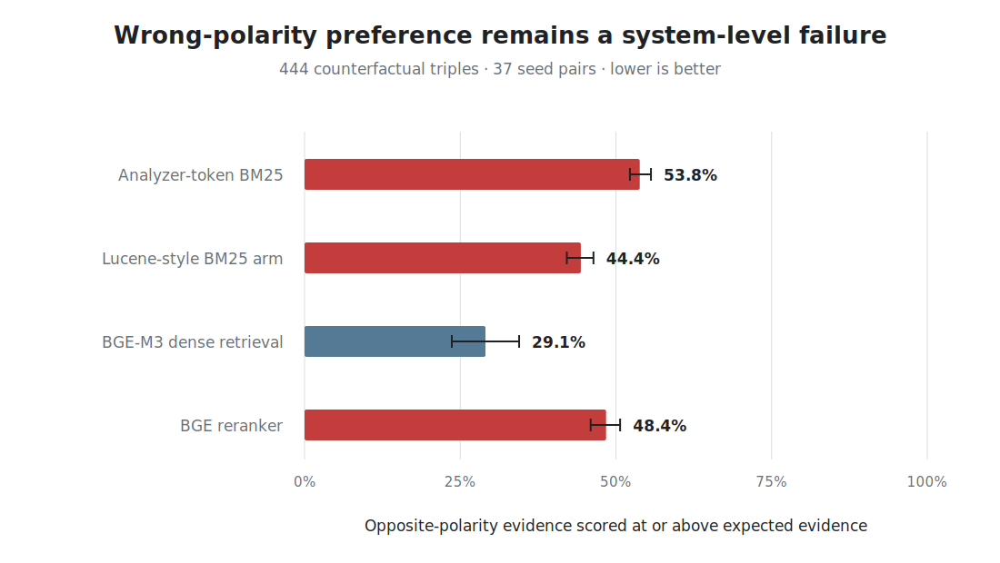

# Three Ways Korean Meaning Disappears Before Ranking Begins

**A representation-correctness case study across Unicode, Korean morphology,
and Lucene token graphs**

A retrieval model can be well calibrated and still rank the wrong evidence.
Sometimes the decisive distinction has already been changed or discarded before
BM25, an embedding model, or a reranker receives a candidate.

This case study connects three production-shaped failures that I traced into
Apache Lucene and Elasticsearch. They occurred at different boundaries, but all
three violated one higher-level requirement:

> A search pipeline must preserve the distinctions needed to determine relevance.

All three investigations resulted in merged upstream contributions. The local
observations and insurance stress measurements below establish bounded failure
cases, not a claim that every Korean search system has the same defects.

## Deep Dives

- [When an Exact Phrase Returns Zero Results](exact-phrase-zero-results.md):
  token graphs, position holes, query-tree compilation, and Elasticsearch
  `#152931`.
- [When a Korean Analyzer Reverses Meaning](analyzer-reverses-meaning.md):
  `XPN` prefix removal, polarity-aware evaluation, and Elasticsearch `#151157`.



## Results At A Glance

| Boundary | Counterexample | Observable failure | Upstream result |
|---|---|---|---|
| Unicode -> tokenizer | NFC Hangul vs. canonically equivalent NFD conjoining jamo | Equivalent text receives different Korean analysis. | [Lucene #16242](https://github.com/apache/lucene/pull/16242), implementation merged |
| Morphology -> filtered tokens | `비급여` (non-covered) vs. `급여` (covered) | A meaning-bearing prefix is removed and opposing concepts become indistinguishable. | [Elasticsearch #151157](https://github.com/elastic/elasticsearch/pull/151157), official guidance merged |
| Token graph -> phrase query | `보험계약대출이율` with a removed particle | The exact source phrase returns zero hits at `slop=0`. | [Elasticsearch #152931](https://github.com/elastic/elasticsearch/pull/152931), implementation merged |

The checked-in [upstream manifest](evidence/upstream-contributions.json) records
merge commits, dates, changed-file counts, and contribution types. It keeps the
documentation contribution distinct from the two code changes.

## 1. Canonically Equivalent Hangul, Different Analysis

Modern Hangul syllables may be represented as precomposed NFC syllables or as
NFD sequences of conjoining L/V/T jamo. These strings are canonically equivalent
Unicode text, but Lucene's `KoreanTokenizer` expects the precomposed form for
normal Korean analysis. NFD input can therefore cross the tokenizer boundary as
jamo rather than as the equivalent Korean syllable.

In the checked-in Elasticsearch 8.15.3 observation, NFC
`보험계약대출이율` receives a structured nori token graph, while its canonically
equivalent NFD form becomes one jamo-sequence token.



[Lucene #16242](https://github.com/apache/lucene/pull/16242) added an opt-in
`HangulCompositionCharFilter` to `analysis-nori`. It composes only modern
conjoining-jamo sequences before tokenization and preserves offset correction to
the original input. Compatibility jamo, archaic jamo, partial sequences,
already-precomposed Korean, and non-Hangul text remain out of scope.

The merged contribution includes NFC/NFD term and part-of-speech equivalence,
original-input offset checks, randomized modern Hangul composition, boundary
tests, factory registration, and invalid-argument coverage.

**Invariant:** canonical representation choices must not silently change Korean
retrievability.

## 2. Morphology That Reverses Insurance Meaning

The default `nori_part_of_speech` stop-tag set includes `XPN`, the tag used for
prefixes in terms such as `비급여`. Removing the prefix changes the analyzed form:

```text
비급여  (non-covered)      -> 급여  (covered)
부담보  (excluded coverage) -> 담보  (coverage)
```

This is not harmless stemming. The removed component carries the contrastive
meaning needed to determine relevance. Once the forms share the same remaining
token, downstream ranking cannot infer which concept the source expressed.

[Elasticsearch #151157](https://github.com/elastic/elasticsearch/pull/151157)
added an explicit warning and two remedies to the official nori documentation:

1. Preserve known high-risk compounds through `user_dictionary_rules`.
2. Use custom `stoptags` that retain `XPN`, while measuring any added prefix noise.

This was deliberately a documentation and configuration contribution. A global
behavior change would alter existing indexes, so the safe remedy depends on each
domain's term and query distributions.

**Invariant:** analyzer optimization must not collapse contrastive concepts
without an explicit product decision.

## 3. The Exact Source Phrase That Returned Zero Hits

The `slop=0` graph-phrase path had two query-construction defects:

1. `createSpanQuery` emitted a pending position gap one clause too early.
2. `analyzeGraphPhrase` dropped gaps between articulation-point segments.

With nori mixed decompounding and a part-of-speech filter,
`보험계약대출이율` produces a graph and a hole where the particle `이` was removed:

```text
보험계약@0(len2) 보험@0 계약@1 대출@2 율@4
```

Before the fix, query construction required `율` adjacent to `대출`. A document
containing the exact source string therefore returned zero hits at `slop=0`.
Raising slop selected another path and hid the defect; it did not repair the
zero-slop semantics.


[Elasticsearch #152931](https://github.com/elastic/elasticsearch/pull/152931)
placed `SpanGap` after the correct clause and carried position increments through
a `SpanNearQuery.Builder`. Its merged tests cover gaps before, inside, and after
graph side paths, synonym-plus-stop chains, and a nori end-to-end reproduction.

**Invariant:** phrase-query construction must preserve the positional evidence in
the analyzed token graph.

## The System-Level Gap: Fixes Are Not The Evaluation

A unit-level reproduction proves that one boundary is broken. It does not tell us
how often a complete retrieval system prefers wrong evidence. The companion
polarity stress study therefore asks a separate system-level question:

> When expected and opposite-polarity evidence are both candidates, how often is
> the opposing evidence scored at or above the expected evidence?

Across 444 counterfactual triples derived from 37 seed evidence pairs, every
tested architecture remained vulnerable. Lower is better.



| System | Wrong-polarity preferred | Seed-pair bootstrap 95% CI |
|---|---:|---:|
| Analyzer-token BM25 | 53.8% | 52.3% - 55.6% |
| Lucene-style BM25 sensitivity arm | 44.4% | 42.1% - 46.4% |
| BGE-M3 dense retrieval | 29.1% | 23.6% - 34.5% |
| BGE reranker | 48.4% | 45.9% - 50.7% |

These results do not estimate production error rates. The 444 triples are
counterfactual variants, not independent documents, so confidence intervals are
clustered by seed pair. The [full aggregate report](../../reports/private_polarity_stress_pilot.md)
keeps the model, metric, provenance hashes, intent asymmetry, and privacy boundary
explicit.

The point is more useful than “lexical bad, dense good.” Dense retrieval reduced
the aggregate error but did not eliminate it, and the tested reranker increased
the error again. Representation fixes and system-level contrastive evaluation are
complements, not substitutes.

## A Reusable Correctness Protocol

| Layer | Unit invariant | System probe | Release evidence |
|---|---|---|---|
| Character representation | NFC/NFD equivalents receive equivalent analysis and valid offsets. | Script-variant slice | Lucene regression tests + synthetic observation |
| Morphological filtering | Opposing concepts remain distinguishable. | Counterfactual polarity triples | Official configuration guidance + 444-triple aggregate stress report |
| Token graph compilation | Exact source text remains matchable at declared slop. | Phrase-position slice | Elasticsearch unit and nori end-to-end regression tests |

This is the bridge from an upstream bug fix to search-quality engineering:
identify the responsible boundary, define the invariant, add a minimal regression,
then measure whether complete systems preserve the same distinction.

## What This Establishes

The public record demonstrates work across several layers of search correctness:

- Unicode composition and offset-correct character processing in Apache Lucene;
- Korean morphological semantics and analyzer configuration in Elasticsearch;
- token-graph query construction and span semantics in Elasticsearch;
- contrastive retrieval evaluation across lexical, dense, and reranked systems;
- privacy-safe reporting that separates public evidence from private text.

It does not establish that lexical retrieval is always preferable to dense
retrieval, that all Korean analyzers have these failures, or that stress-test
rates are production prevalence estimates.

## Reproduce And Audit

```bash
make build-upstream-case-study
make check-upstream-case-study
```

The build uses only checked-in aggregate or synthetic evidence:

- [Local analyzer and phrase observations](evidence/local-observations.json)
- [Merged upstream contribution manifest](evidence/upstream-contributions.json)
- [Generated evidence summary](evidence/SUMMARY.md)
- [Aggregate polarity stress JSON](../../reports/private_polarity_stress_pilot.json)
- [Pure-Python report and SVG builder](../../scripts/build_upstream_correctness_case_study.py)

## Takeaway

> Search relevance is meaningful only after every representation boundary
> preserves the distinctions that relevance depends on.
