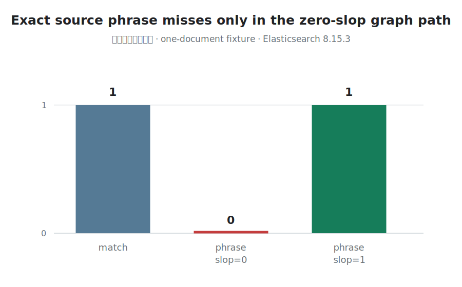

# When an Exact Phrase Returns Zero Results

**A token-graph correctness failure in Elasticsearch phrase-query construction**

A one-document index contained the exact Korean source string
`보험계약대출이율`. A bag-of-words query found it. A phrase query with `slop=1`
found it. The exact `match_phrase` query with `slop=0` returned zero results.

The failure was not caused by BM25 scoring or insufficient recall. Korean
analysis had already produced the necessary token graph. Elasticsearch lost part
of that graph's positional evidence while compiling it into an executable phrase
query.



## Minimal Reproduction

The checked-in synthetic observation was recorded on Elasticsearch `8.15.3`
with Lucene `9.11.1`. The fixture contains one document and no private text.

Nori mixed decompounding emits both the compound path and its component path.
A part-of-speech filter removes the particle `이`, leaving a position hole before
`율`:

```text
보험계약@0(len2) 보험@0 계약@1 대출@2 율@4
```

The same source string was submitted through three query paths:

| Query | Hits |
|---|---:|
| `match` | 1 |
| `match_phrase`, `slop=0` | 0 |
| `match_phrase`, `slop=1` | 1 |

The zero-slop query explanation was:

```text
spanNear([
  spanOr([
    text:보험계약,
    spanNear([text:보험, text:계약], 0, true)
  ]),
  text:대출,
  text:율
], 0, true)
```

The query contains the graph alternatives but places `율` directly after
`대출`. The analyzed stream says otherwise: the removed particle left one
position between them.

## Broken Invariant

> Compiling an analyzed token graph into a phrase query must preserve every
> position increment that contributes to the declared phrase semantics.

The strongest counterexample is the source string itself. When a document is
analyzed and a query containing the same text is analyzed with the corresponding
search analyzer, a zero-slop phrase query should not become stricter because the
query builder discarded a represented hole.

## Root Cause

The `slop=0` graph-phrase path had two separate defects.

### 1. A pending gap was emitted before the wrong clause

`createSpanQuery` accumulated a position gap but inserted the `SpanGap` before
the current clause rather than after the clause that preceded the hole. The
resulting `SpanNearQuery` expressed a different position relation from the token
stream.

### 2. Gaps between graph segments were dropped

`analyzeGraphPhrase` divided a token graph at articulation points and built the
outer phrase from those segments. That outer construction did not carry the
position increments between segments, so a correctly represented hole vanished
at the next boundary.

Both defects mattered. Fixing only one query-building helper would leave another
graph shape incorrect.

## Why Existing Evaluation Could Miss It

Several plausible tests do not exercise this failure:

- bag-of-words retrieval ignores token positions;
- synonym tests without a removed-token hole preserve adjacency;
- phrase tests over a linear token stream never enter the graph path;
- `slop=1` selects behavior that can tolerate the lost gap;
- aggregate nDCG can hide a missing exact-phrase path when other candidates are
  still retrievable.

Increasing slop is therefore a workaround with changed semantics, not a fix. It
makes every phrase less strict to compensate for a query compiler that made this
one phrase too strict.

## Upstream Fix

[Elasticsearch #152931](https://github.com/elastic/elasticsearch/pull/152931)
made both position-preservation changes:

1. emit `SpanGap` after the clause that precedes the hole;
2. build graph-phrase segments with a `SpanNearQuery.Builder` that carries the
   relevant position increments.

The merged regression suite covers:

- gaps before, inside, and after graph side paths;
- more than one gap around a graph segment;
- a synonym graph followed by a stop filter;
- the nori mixed-decompound and part-of-speech end-to-end reproduction;
- an analyzer ordering intentionally documented as out of scope.

The change was merged as commit
[`663c818c1f33`](https://github.com/elastic/elasticsearch/commit/663c818c1f33f26c43b5c625fc5626cec1206d6a).

## Reusable Diagnostic

Phrase correctness should be tested as a relation between four artifacts, not as
a single search result:

```text
source text
→ analyzed token graph
→ compiled query tree
→ matching documents
```

A useful regression family varies one boundary at a time:

| Condition | Expected relation |
|---|---|
| Exact source text, linear stream | Matches at declared slop |
| Exact source text, graph without holes | Same phrase semantics across graph paths |
| Exact source text, graph with a removed-token hole | Hole survives query construction |
| Same graph, larger slop | May broaden matches but must not be required to repair compilation |

This diagnostic applies beyond Korean. Any `synonym_graph`, decompounder, or
token-removing filter can create the same combination of alternatives and
position holes.

## Evidence And Scope

- [Synthetic local observation](evidence/local-observations.json)
- [Generated evidence summary](evidence/SUMMARY.md)
- [Merged upstream PR](https://github.com/elastic/elasticsearch/pull/152931)
- [Umbrella representation-correctness case study](README.md)

The checked-in chart records pre-fix behavior on Elasticsearch `8.15.3`.
Post-fix correctness is established by the merged Elasticsearch regression tests;
this public artifact does not claim a separate patched-runtime benchmark or a
general change in Korean retrieval quality.

## Takeaway

> The analyzer had preserved the evidence. The query builder changed its meaning
> before ranking began.
